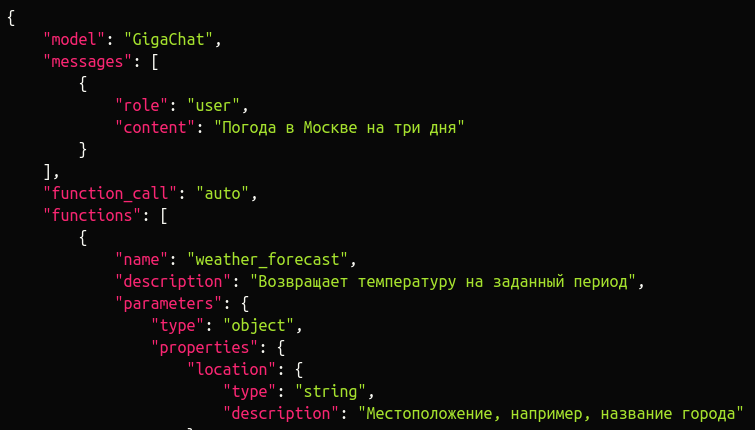
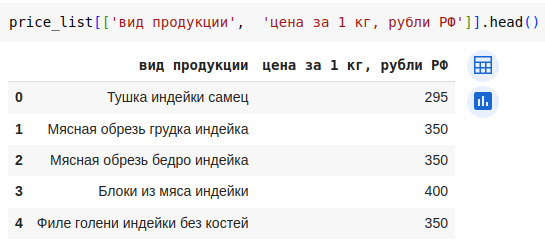

# Tutorial: в gigachat появился function calling


Недавно в документации к API GigaChat появился раздел, посвящённый [работе с функциями](https://developers.sber.ru/docs/ru/gigachat/api/function-calling), аналогично тому, как это реализовано в ChatGPT. 
Идея заключается в том, что модели передаётся информация о доступных ей функциях, и в зависимости от запроса пользователя модель может обратиться к этим фунциям и добавить их результат к промту для генерации ответа.

Таким образом, можно не загружать в промт весь объём данных, а вызывать только необходимый фрагмент, необходимый ассистенту для работы, и экономить количество токенов на генерацию.

Если вы попросите Chat GPT продать вам function calling, то получите примерно следующее:
```
Функция вызова в Chat GPT открывает новые возможности для разработчиков и предпринимателей, позволяя создавать более интеллектуальные и интерактивные приложения. С этой функцией вы можете:

Автоматизировать задачи: Используйте Chat GPT для автоматизации рутинных задач, таких как отправка электронных писем или обновление баз данных.
Интегрировать с внешними API: Подключайте вашего бота к внешним сервисам, чтобы получать актуальную информацию, например, о погоде или курсах валют.
Улучшать пользовательский опыт: Создавайте более глубокое взаимодействие с пользователями, предоставляя им полезные данные и услуги прямо в чате.

Используйте функцию вызова в Chat GPT, чтобы вывести ваши проекты на новый уровень и предложить клиентам уникальный и ценный опыт. Свяжитесь с нами сегодня, чтобы узнать больше!
```

GigaChat же так хорошо function calling не продаёт, функционал этот ещё не доступен в gigachain и доступен через API только для модели `"GigaChat-Pro-preview"`, поэтому я хочу поделиться своим первым опытом его использования.

На странице с документацией вас ожидает множество json схем, которые которые нужно добавить к запросам для вызова функций, а здесь мы рассмотрим, как внедрить вызов функций в свой код.

В моём примере, помимо информации о погоде, ассистент будет получать из гугл-таблицы цены на запрошенные продукты, и передавать их пользователю.



За основу я взял код из этого [видео](https://youtu.be/DfT_xXDQyCQ?si=bm5unO-PWlNHXS3F), рекомендую ознакомиться с ним для начала изучения работы с API GigaChat.

Начнём с авторизации.
```python
from google.colab import userdata
# auth token API GigaChat
giga_key = userdata.get('GIGA_CHAT_KEY')
# id гугл-таблицы из которой будем получать данные
price_id = userdata.get('PRICE_ID')
```
С помощью auth token получим временный токен для обращения к API, токен действителен 30 минут:
``` python
import requests
import uuid

def get_token(auth_token, scope='GIGACHAT_API_CORP'):
    """
      Выполняет POST-запрос к эндпоинту, который выдает токен.

      Параметры:
      - auth_token (str): токен авторизации, необходимый для запроса.
      - область (str): область действия запроса API. По умолчанию — «GIGACHAT_API_PERS».

      Возвращает:
      - ответ API, где токен и срок его "годности".
      """
    # Создадим идентификатор UUID (36 знаков)
    rq_uid = str(uuid.uuid4())

    # API URL
    url = "https://ngw.devices.sberbank.ru:9443/api/v2/oauth"

    # Заголовки
    headers = {
        'Content-Type': 'application/x-www-form-urlencoded',
        'Accept': 'application/json',
        'RqUID': rq_uid,
        'Authorization': f'Basic {auth_token}'
    }

    # Тело запроса
    payload = {
        'scope': scope
    }

    try:
        # Делаем POST запрос с отключенной SSL верификацией
        # (можно скачать сертификаты Минцифры, тогда отключать проверку не надо)
        response = requests.post(url, headers=headers, data=payload, verify=False)
        return response
    except requests.RequestException as e:
        print(f"Ошибка: {str(e)}")
        return -1
```
Если пользуетесь GigaChat как физическое лицо, то укажите аргумент `scope=«GIGACHAT_API_PERS»`
```pyhton
response = get_token(giga_key)
if response != 1:
  print(response.text)
  giga_token = response.json()['access_token']
```
```json
{"access_token":"token","expires_at":1712650905952}
```
Запрос вернёт токен и срок его истечения в формате временной метки в миллисекундах, для наглядности преобразуем его в формат даты и времени:
```python
from datetime import datetime

# Временная метка в миллисекундах
timestamp_ms = response.json()["expires_at"]

# Преобразование в секунды
timestamp_s = timestamp_ms / 1000

# Преобразование в объект datetime
date_time = datetime.utcfromtimestamp(timestamp_s)

print(date_time.strftime('%Y-%m-%d %H:%M:%S'))
```
```
2024-04-09 08:21:45
```
Как я уже писал раннее, вызов функций достуупен только для модели `"GigaChat-Pro-preview"`, необходимо проверить что эта модель доступна на вашем тарифе:
```python
import requests

url = "https://gigachat.devices.sberbank.ru/api/v1/models"

payload={}
headers = {
  'Accept': 'application/json',
  'Authorization': f'Bearer {giga_token}'
}

response = requests.request("GET", url, headers=headers, data=payload, verify=False)

print(response.text)
```
```json
{"object":"list","data":[{"id":"GigaChat","object":"model","owned_by":"salutedevices"},{"id":"GigaChat-Plus","object":"model","owned_by":"salutedevices"},{"id":"GigaChat-Pro","object":"model","owned_by":"salutedevices"},{"id":"GigaChat-Pro-preview","object":"model","owned_by":"salutedevices"}]}
```
Если `"GigaChat-Pro-preview"` отображается в вашем списке, то можно переходить к следующему этапу.

Определим пользовательские функции:
```python
def weather_forecast(location):
  """
  Получение погоду в Москве
  """
  return "в Москве +13"
```
Самая простая функция, которая будет выдавать фиксированную строку при любом обращении, но у неё на входе есть аргумент location, сейчас объясню для чего необходимо.

Функции передаются в модель в виде json схемы:
```json

        {
            "name": "weather_forecast",
            "description": "Возвращает температуру на заданный период",
            "parameters": {
                "type": "object",
                "properties": {
                    "location": {
                        "type": "string",
                        "description": "Местоположение, например, название города"
                    },
                    "format": {
                        "type": "string",
                        "enum": [
                            "celsius",
                            "fahrenheit"
                        ],
                        "description": "Единицы изменерия температуры"
                    },
                    "num_days": {
                        "type": "integer",
                        "description": "Период, для которого нужно вернуть прогноз"
                    }
                },
                "required": [
                    "location",
                    "num_days"
                ]
            }
        }
```
В этой схеме есть поле `"properties"`, в котором указаываются параметры, которые модель должна сгенерировать для этой функции, и `"required"`, в котором указывается список обязательных аргументов. В случае, когда функция не требует аргументов на входе, в значениях этих полей по идее нужно указать пустой массив и пустой список, но иногда в таких случаях GigaChat начинает самостоятельно генерировать аргументы, которая функция не будет готова принимать, например для для функции с погодой у меня появился аргумент `'city'`:
```json
{'choices': [{'message': {'content': '', 'role': 'assistant', 'function_call': {'name': 'weather_forecast', 'arguments': {'city': 'Москва'}}}, 'index': 0, 'finish_reason': 'function_call'}], 'created': 1712654212, 'model': 'GigaChat-Pro-preview:2.2.25.3', 'object': 'chat.completion', 'usage': {'prompt_tokens': 389, 'completion_tokens': 15, 'total_tokens': 404, 'system_tokens': 25}}
```
Чтобы таких ситуаций не возникало, я использую фиктивные аргументы, которые можно передавать не боясь, что она сломает функциию, поэтому здесь я передаю аргумент location несмотря что на выходе у меня фиксированная строка.

Определим ещё пару функций:
```python
def get_prices(products):
  if isinstance(products, str):
    products = [products]
  return json.dumps(price_list[price_list['вид продукции'].isin(products)][['вид продукции', 'цена за 1 кг, рубли РФ']].to_dict(orient='records'), ensure_ascii=False)
```
Для этой функции будет генерироваться список подходящих продуктов, для которых будут получены цены из прайс-листа.
```python
def get_full_pricelist(products):
    """
    Получение информации по всей продукции
    """
    return json.dumps(price_list[['вид продукции', 'цена за 1 кг, рубли РФ']].to_dict(orient='records'), ensure_ascii=False)
```
Функция при запросе выдаёт все доступные цены из прайслиста, здесь так же используется фиктивный параметр `'products'`.
Создадим json схему функций для модели:
```python
giga_functions = [
    {
        "name": "weather_forecast",
        "description": "Возвращает температуру в Москве",
        "parameters": {
            "type": "object",
            "properties": {
                "location": {
                    "type": "string",
                    "description": "Местоположение, например, название города"
                    }
            },
            "required": ["location"]
            },
        "return_parameters": {
            "type": "object",
            "properties": {
                "location": {
                    "type": "string",
                    "description": "Местоположение, например, название города"
                    },
                "temperature": {
                    "type": "integer",
                    "description": "Температура для заданного местоположения"
                    },
                "forecast": {
                    "type": "array",
                    "items": {
                        "type": "string"
                        },
                    "description": "Описание погодных условий"
                    },
                "error": {
                    "type": "string",
                    "description": "Возвращается при возникновении ошибки. Содержит описание ошибки"
                    }
                }
            }
        },
        {
            "name": "get_full_pricelist",
            "description": "Возвращает цены на всю имеющуюуся продукцию",
            "parameters": {
                "type": "object",
                "properties": {
                    "products": {
                        "type": "string",
                        "description": f"список наиболее подходящих продуктов из списка {price_list['вид продукции'].to_list()}"
                        }
                    },
                "required": ["products"]
                },
            "return_parameters": {
                "type": "object",
                "properties": {
                    "product": {
                        "type": "string",
                        "description": "Наименование продукции"
                        },
                    "price": {
                        "type": "integer",
                        "description": "Цена продукции в рублях РФ"
                        },
                    "error": {
                        "type": "string",
                        "description": "Возвращается при возникновении ошибки. Содержит описание ошибки"
                        }
                    }
                }
            },
             {
                 "name": "get_prices",
                 "description": "Возвращает цену на запрашиваемый продукт",
                 "parameters": {
                     "type": "object",
                     "properties": {
                         "products": {
                             "type": "string",
                             "description": f"список наиболее подходящих продуктов из списка {price_list['вид продукции'].to_list()}"
                             }
                         },
                     "required": [
                         "products"
                         ]
                     },
                 "few_shot_examples": [
                     {
                         "request": "сколько стоит лопатка?",
                         "params": {
                             "products": ["Свиная лопатка"]
                             }
                         }
                     ],
                 "return_parameters": {
                     "type": "object",
                     "properties": {
                         "products": {
                             "type": "string",
                             "description": "Наименование продукции"
                             },
                         "price": {
                             "type": "integer",
                             "description": "Цена для данного вида продукции"
                             },
                         "error": {
                             "type": "string",
                             "description": "Возвращается при возникновении ошибки. Содержит описание ошибки"
                             }
                         }
                     }
                 }
    ]
```
Здесь описанием аргумента функции `''get_prices` является f-строка со списком из продуктов, которые есть в прайслисте, чтобы модель генерировала корректные аргументы для обращения к функции, это почти всегда работает, но исключения конечно бывают.

Ну и наконец создадим функцию, которая примет вопрос пользователя, при необходимости вызовет какую-либо функцию, и сгенерирует ответ.

```python
import requests
import json

def get_chat_completion(auth_token, user_message, conversation_history=None):
    """
    Отправляет POST-запрос к API чата для получения ответа от модели GigaChat в рамках диалога.

    Параметры:
    - auth_token (str): Токен для авторизации в API.
    - user_message (str): Сообщение от пользователя, для которого нужно получить ответ.
    - conversation_history (list): История диалога в виде списка сообщений (опционально).

    Возвращает:
    - response (requests.Response): Ответ от API.
    - conversation_history (list): Обновленная история диалога.
    """
    # URL API, к которому мы обращаемся
    url = "https://gigachat.devices.sberbank.ru/api/v1/chat/completions"

    # Если история диалога не предоставлена, добавляем в неё системный промт
    if conversation_history is None or conversation_history == []:
        conversation_history = [
            {
                "role": "system",
                "content": "ты менеджер по продажам, твоя задача сообщать цены из прайс-листа и погоду"
                }
            ]

    # Добавляем сообщение пользователя в историю диалога
    conversation_history.append({
        "role": "user",
        "content": user_message
    })
    # json схемы доступных функций
    giga_functions = [
    {
        "name": "weather_forecast",
        "description": "Возвращает температуру в Москве",
        "parameters": {
            "type": "object",
            "properties": {
                "location": {
                    "type": "string",
                    "description": "Местоположение, например, название города"
                    }
            },
            "required": ["location"]
            },
        "return_parameters": {
            "type": "object",
            "properties": {
                "location": {
                    "type": "string",
                    "description": "Местоположение, например, название города"
                    },
                "temperature": {
                    "type": "integer",
                    "description": "Температура для заданного местоположения"
                    },
                "forecast": {
                    "type": "array",
                    "items": {
                        "type": "string"
                        },
                    "description": "Описание погодных условий"
                    },
                "error": {
                    "type": "string",
                    "description": "Возвращается при возникновении ошибки. Содержит описание ошибки"
                    }
                }
            }
        },
        {
            "name": "get_full_pricelist",
            "description": "Возвращает цены на всю имеющуюуся продукцию",
            "parameters": {
                "type": "object",
                "properties": {
                    "products": {
                        "type": "string",
                        "description": f"список наиболее подходящих продуктов из списка {price_list['вид продукции'].to_list()}"
                        }
                    },
                "required": ["products"]
                },
            "return_parameters": {
                "type": "object",
                "properties": {
                    "product": {
                        "type": "string",
                        "description": "Наименование продукции"
                        },
                    "price": {
                        "type": "integer",
                        "description": "Цена продукции в рублях РФ"
                        },
                    "error": {
                        "type": "string",
                        "description": "Возвращается при возникновении ошибки. Содержит описание ошибки"
                        }
                    }
                }
            },
             {
                 "name": "get_prices",
                 "description": "Возвращает цену на запрашиваемый продукт",
                 "parameters": {
                     "type": "object",
                     "properties": {
                         "products": {
                             "type": "string",
                             "description": f"список наиболее подходящих продуктов из списка {price_list['вид продукции'].to_list()}"
                             }
                         },
                     "required": [
                         "products"
                         ]
                     },
                 "few_shot_examples": [
                     {
                         "request": "сколько стоит лопатка?",
                         "params": {
                             "products": ["Свиная лопатка"]
                             }
                         }
                     ],
                 "return_parameters": {
                     "type": "object",
                     "properties": {
                         "products": {
                             "type": "string",
                             "description": "Наименование продукции"
                             },
                         "price": {
                             "type": "integer",
                             "description": "Цена для данного вида продукции"
                             },
                         "error": {
                             "type": "string",
                             "description": "Возвращается при возникновении ошибки. Содержит описание ошибки"
                             }
                         }
                     }
                 }
    ]
    # Подготовка данных запроса в формате JSON
    payload = json.dumps({
        "model": "GigaChat-Pro-preview",
        "messages": conversation_history,
        "function_call": "auto",
        "functions": giga_functions,
        "temperature": 0.5,
        "top_p": 0.1,
        "n": 1,
        "stream": False,
        "max_tokens": 32000,
        "repetition_penalty": 1,
        "update_interval": 0
    })
    # Заголовки запроса
    headers = {
        'Content-Type': 'application/json',
        'Accept': 'application/json',
        'Authorization': f'Bearer {auth_token}'
    }
    # словарь с функциями для обработки запроса
    available_functions = {
        "weather_forecast": weather_forecast,
        "get_full_pricelist": get_full_pricelist,
        "get_prices": get_prices
        }
    # Выполнение POST-запроса и возвращение ответа
    try:
        response = requests.post(url, headers=headers, data=payload, verify=False)
        response_data = response.json()
        # проверяем ответ модели на наличие обращений к функциям
        try:
          # json с информацией о необходимой функции
          func_calls = response_data['choices'][0]['message']['function_call']
          # имя вызываемой функции
          func_name = func_calls['name']
          # аргументы вызываемой функции
          func_args = func_calls['arguments']
          # достаём нужную функцию из словаря 
          function_to_call = available_functions[func_name]
          
          # добавляем в историю сообщений ответ модели с вызовом функции, БЕЗ ЭТОГО МОДЕЛЬ НЕ ОТВЕТИТ
          conversation_history.append(response_data['choices'][0]['message'])
          # добавляем в историю сообщений результаты функции
          conversation_history.append(
              {
                  "role": "function",
                  "content": function_to_call(**func_args),
                  "name": func_name
                  }
              )
          # обновляем данные
          payload = json.dumps({
              "model": "GigaChat-Pro-preview",
              "messages": conversation_history,
              "function_call": "auto",
              "functions": giga_functions,
              "temperature": 0.5,
              "top_p": 0.1,
              "n": 1,
              "stream": False,
              "max_tokens": 32000,
              "repetition_penalty": 0.5,
              "update_interval": 0
              })
          # повторяем зарос  
          response = requests.post(url, headers=headers, data=payload, verify=False)
          response_data = response.json()
          # for func in func_calls:
        except:
          pass

        # Добавляем ответ модели в историю диалога
        conversation_history.append({
            "role": "assistant",
            "content": response_data['choices'][0]['message']['content']
        })

        return response, conversation_history
    except requests.RequestException as e:
        # Обработка исключения в случае ошибки запроса
        print(f"Произошла ошибка: {str(e)}")
        return None, conversation_history
```

Примеры получаемых ответов:

```python
conversation_history = []

response, conversation_history = get_chat_completion(giga_token, "какая погода в Москве?", conversation_history)
```
```json
[{'role': 'system',
  'content': 'ты менеджер по продажам, твоя задача сообщать цены из прайс-листа и погоду'},
 {'role': 'user', 'content': 'какая погода в Москве?'},
 {'content': '',
  'role': 'assistant',
  'function_call': {'name': 'weather_forecast',
   'arguments': {'location': 'Москва'}}},
 {'role': 'function', 'content': 'в Москве +13', 'name': 'weather_forecast'},
 {'role': 'assistant', 'content': 'В Москве сейчас +13°С.'}]
 ```
 узнали о погоде
 ```python
conversation_history = []

response, conversation_history = get_chat_completion(giga_token, "дай цены по всей продукции", conversation_history)
```
```json
[{'role': 'system',
  'content': 'ты менеджер по продажам, твоя задача сообщать цены из прайс-листа и погоду'},
 {'role': 'user', 'content': 'дай цены по всей продукции'},
 {'content': '',
  'role': 'assistant',
  'function_call': {'name': 'get_full_pricelist',
   'arguments': {'products': 'всю'}}},
 {'role': 'function',
  'content': '[{"вид продукции": "Тушка индейки самец", "цена за 1 кг, рубли РФ": "295"}, ... , {"вид продукции": "Свиная шея", "цена за 1 кг, рубли РФ": "400"}]',
  'name': 'get_full_pricelist'},
 {'role': 'assistant',
  'content': 'Цены на всю продукцию следующие: Тушка индейки самец - 295 рублей за 1 кг, ... , Свиная шея - 400 рублей за 1 кг.'}]
  ```
получили цены из прайслиста

```python
conversation_history = []

response, conversation_history = get_chat_completion(giga_token, "сколько стоит рагу и какая погода в москве?", conversation_history)
```
```json
[{'role': 'system',
  'content': 'ты менеджер по продажам, твоя задача сообщать цены из прайс-листа и погоду'},
 {'role': 'user', 'content': 'сколько стоит рагу и какая погода в москве?'},
 {'content': '',
  'role': 'assistant',
  'function_call': {'name': 'get_prices',
   'arguments': {'products': 'Рагу индейки  (монолит), Рагу индейки (лоток)'}}},
 {'role': 'function', 'content': '[]', 'name': 'get_prices'},
 {'role': 'assistant',
  'content': 'Извините, но я не могу предоставить вам информацию о цене рагу. Могу ли я помочь вам с чем-то ещё?'}]
  ```
Здесь модель сгенерировала аргумент строкой, а не списком, поэтому продукты не нашлись в датафрейме, этот случай можно обработать. Другое дело, что здесь модель вызывает только одну функцию, а не две, как треюует контекст. Впрочем не надо забывать, что функционал находится на этапе `'preview'` и это скорее всего улучшат.

Вот такой мой первый опыт использования вызова функций в API GigaChat, делитесь своими идеями/мнениями/советами на данную тему, весь код выложу на [гитхаб](https://github.com/romauov/gigachat_api_function_calling) и ещё раз поделюсь [видео](https://youtu.be/DfT_xXDQyCQ?si=bm5unO-PWlNHXS3F), с которого я начал своё знакомство c API GigaChat.

